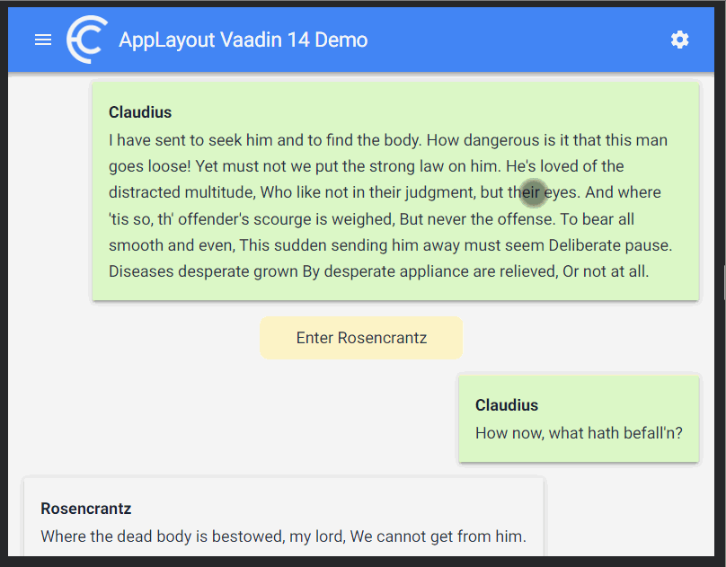

[](https://vaadin.com/directory/component/flowingcodefc-applayout)
[](https://www.npmjs.com/package/@flowingcode/fc-applayout)
# fc-applayout

Responsive and flexible LitElement based Application Layout. Built using [@polymer/app-layout](https://www.webcomponents.org/element/@polymer/app-layout)

## Features
* Configurable Profile section in Drawer
* Configurable Title section in main header
* Components in toolbar
* Components in menu section in drawer
* Easy to setup, just a single element



## Example
```html
<fc-applayout title="Application Layout">
      <div slot="title" main-title="">AppLayout  Demo</div>
      <paper-icon-button slot="toolbar" icon="settings" title="Settings" role="button"></paper-icon-button>
      <div slot="menu">
        <p onclick="this.dispatchEvent(new CustomEvent('item-clicked', {bubbles: true}))">This is menu</p>
      </div>
      <div>Content</div>
</fc-applayout>
```

## Setup

Install dependencies:

```bash
npm i
```

## Build

This project uses the TypeScript compiler to produce JavaScript that runs in modern browsers.

To build the JavaScript version of it:

```bash
npm run build
```

To watch files and rebuild when the files are modified, run the following command in a separate shell:

```bash
npm run build:watch
```

Both the TypeScript compiler and lit-analyzer are configured to be very strict. You may want to change `tsconfig.json` to make them less strict.

## Testing

This project uses Karma, Chai, Mocha, and the open-wc test helpers for testing. See the [open-wc testing documentation](https://open-wc.org/testing/testing.html) for more information.

Tests can be run with the `test` script:

```bash
npm test
```

## Dev Server

This sample uses open-wc's [es-dev-server](https://github.com/open-wc/open-wc/tree/master/packages/es-dev-server) for previewing the project without additional build steps. ES dev server handles resolving Node-style "bare" import specifiers, which aren't supported in browsers. It also automatically transpiles JavaScript and adds polyfills to support older browsers.

To run the dev server and open the project in a new browser tab:

```bash
npm run serve
```

There is a development HTML file located at `/dev/index.html` that you can view at http://localhost:8000/dev/index.html.

## Editing

If you use VS Code, we highly reccomend the [lit-plugin extension](https://marketplace.visualstudio.com/items?itemName=runem.lit-plugin), which enables some extremely useful features for lit-html templates:
  - Syntax highlighting
  - Type-checking
  - Code completion
  - Hover-over docs
  - Jump to definition
  - Linting
  - Quick Fixes
  
  The project is setup to reccomend lit-plugin to VS Code users if they don't already have it installed.

## Linting

Linting of TypeScript files is provided by [ESLint](eslint.org) and [TypeScript ESLint](https://github.com/typescript-eslint/typescript-eslint). In addition, [lit-analyzer](https://www.npmjs.com/package/lit-analyzer) is used to type-check and lint lit-html templates with the same engine and rules as lit-plugin.

The rules are mostly the recommended rules from each project, but some have been turned off to make LitElement usage easier. The recommended rules are pretty strict, so you may want to relax them by editing `.eslintrc.json` and `tsconfig.json`.

To lint the project run:

```bash
npm run lint
```

## Formatting

[Prettier](https://prettier.io/) is used for code formatting. It has been pre-configured according to the Polymer Project's style. You can change this in `.prettierrc.json`.

Prettier has not been configured to run when commiting files, but this can be added with Husky and and `pretty-quick`. See the [prettier.io](https://prettier.io/) site for instructions.

## Static Site

This project includes a simple website generated with the [eleventy](11ty.dev) static site generator and the templates and pages in `/docs-src`. The site is generated to `/docs` and intended to be checked in so that GitHub pages can serve the site [from `/docs` on the master branch](https://help.github.com/en/github/working-with-github-pages/configuring-a-publishing-source-for-your-github-pages-site).

To enable the site go to the GitHub settings and change the GitHub Pages &quot;Source&quot; setting to &quot;master branch /docs folder&quot;.</p>

To build the site, run:

```bash
npm run docs
```

To serve the site locally, run:

```bash
npm run docs:serve
```

To watch the site files, and re-build automatically, run:

```bash
npm run docs:watch
```

The site will usually be served at http://localhost:8000.

## Bundling and minification

This starter project doesn't include any build-time optimizations like bundling or minification. We recommend publishing components as unoptimized JavaScript modules, and performing build-time optimizations at the application level. This gives build tools the best chance to deduplicate code, remove dead code, and so on.

For information on building application projects that include LitElement components, see [Build for production](https://lit-element.polymer-project.org/guide/build) on the LitElement site.

## License & Author

Add-on is distributed under Apache License 2.0. For license terms, see LICENSE.txt.

fc-applayout is written by [Flowing Code S.A.](https://www.flowingcode.com)
